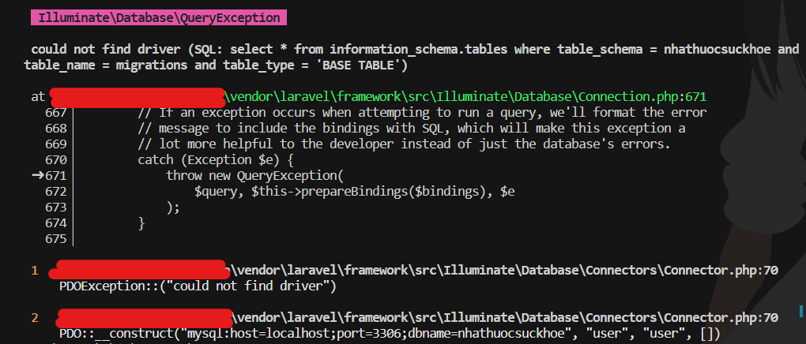
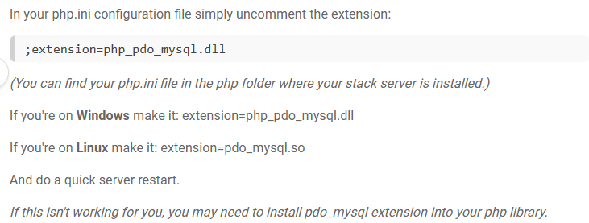

## Requirement
- php 7.3 or higher (To check version, run `php --version`)
- composer (To check version, run `composer --version`)

## Installation:
### (If some of commands below cause Error - Check [Handle errors](#e))
### 1. Install necessary packages:
```
composer install
```
If php version difference tha
```
composer install --ignore-platform-req
```

### 2. Create database and table
Create a new Database named __nhathuocsuckhoe__ on PhpMyAdmin, MySQL Workbench or any MySQL shell.

On terminal, run command to create tables:
```
php artisan migrate
php artisan db:seed --class=First
```

If you want to use *Test data* (No images), run this command:
```
php artisan db:seed --class=Testing
```

### 3. Link storage folder to public URL
```
php artisan storage:link
```

### 4. Start server - __DONE__
```
php artisan serve
```
Now we can open web with port 8000:
- http://127.0.0.1:8000/
- http://127.0.0.1:8000/admin
    
## Handle errors <a name="e"></a>

### 1. PDOException::("could not find driver")
  
  here the solution:
  
    
