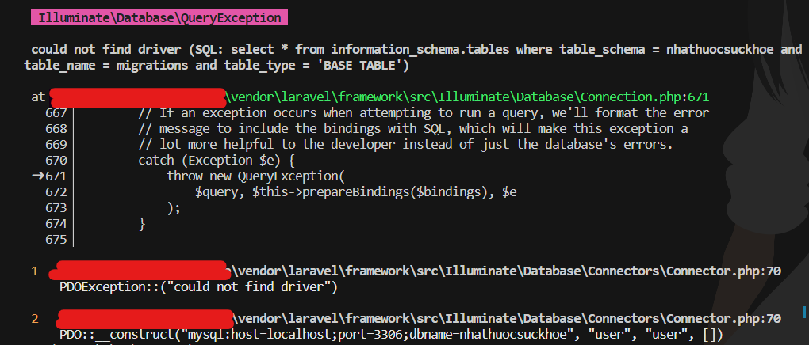
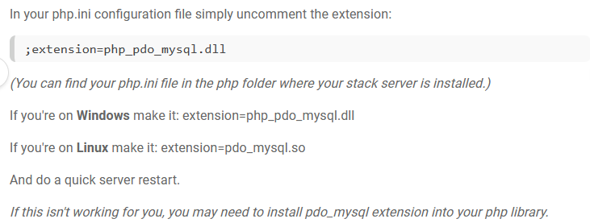

# NhaThuocSucKhoe


A SSR website application for _storing_ and _showing_ pharmacy products. Using PHP Laravel.
- Cart managing
- OTP Code Authorization Plugin Include

## Requirement
- php 7.3 or higher _(To check version, run `php --version`)_
- composer _(To check version, run `composer --version`)_

## Installation:
 __NOTE:__ If some of commands below cause errors - Please check [Handle errors](#e)
### 1. Install necessary packages:
```
composer install
```
Run with other php versions _(May cause some errors)_
```
composer install --ignore-platform-req
```

### 2. Create database and table
Create a new Database named __nhathuocsuckhoe__ on PhpMyAdmin, MySQL Workbench or any MySQL shell.

On terminal, run command to create tables:
```
php artisan migrate
php artisan db:seed --class=First
```

If you want to use *Test data* (No images), run this command:
```
php artisan db:seed --class=Testing
```

### 3. Link storage folder to public URL
```
php artisan storage:link
```

### 4. Start server - __DONE__
```
php artisan serve
```
Now we can open web with port 8000:
- http://127.0.0.1:8000/
- http://127.0.0.1:8000/admin
    
## Handle errors <a name="e"></a>

### 1. PDOException::("could not find driver")
  
  here the solution:
  
    

## Other repository related with this project:

- [MusicPlayer-BackEnd](https://github.com/nguyenanvi/MusicPlayer-BackEnd.git) : Using Java Spring Boot
- [MusicPlayer-FrontEnd](https://github.com/nguyenanvi/MusicPlayer-FrontEnd.git) : In progess... Maybe ReactJS
- [MusicPlayer-FileStorage](https://github.com/nguyenanvi/MusicPlayer-FileStorage.git) : Using NodeJS


## Installation

Install and run with npm

```bash
  npm install
  npm run dev
```
## API Reference

#### Get item

```http
  GET /get/${fileName}
```

| Parameter | Type     | Description                       |
| :-------- | :------- | :-------------------------------- |
| `fileName`      | `string` | **Required**. Name of item to fetch |

#### Save item

```http
  POST /save
```
```html
  <form method="POST" action="http://localhost:8081/save" enctype="multipart/form-data">
    <input type="file" name="file"/>
    <button type="submit">Upload</button>
  </form>
```
#### Get GUI to upload test file

```http
  GET http://localhost:8081/gui/upload
```

## Authors

- [@nguyenanvi](https://www.github.com/nguyenanvi)


## Features

- Light/dark mode toggle
- Live previews
- Fullscreen mode
- Cross platform

